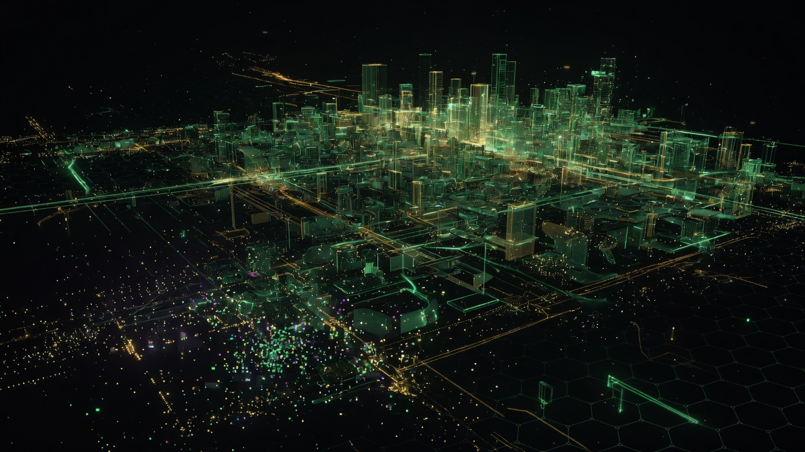
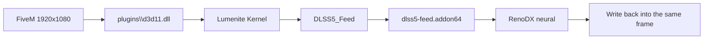

<p align="center">
  
</p>

<h1 align="center">FiveM-DLSS5</h1>

<p align="center">
  <strong>One zip. Drop it into FiveM <code>plugins</code>. Done.</strong><br>
  Neural DLSS 5 for FiveM, built on
  <a href="https://github.com/jlrouzies-fr/DLSS5-Feeder">DLSS5-Feeder</a>.
</p>

<p align="center">
  
  
  
  
</p>

**Contact:** [contact@kerim0x1.com](mailto:contact@kerim0x1.com)

---

## Install (FiveM)

No PowerShell. No Steam `GTA5.exe`. No helper mode.

### 1. Close FiveM completely

Nothing named `FiveM` or `FiveM_b…_GTAProcess` in Task Manager.

### 2. Download the release

One file from [Releases](https://github.com/kerim0x1/FiveM-DLSS5/releases):

```text
FiveM-DLSS5-1.0.0-plugins.zip
```

### 3. Put the contents in this folder

```text
%LOCALAPPDATA%\FiveM\FiveM.app\plugins
```

Full path:

```text
C:\Users\<YOUR NAME>\AppData\Local\FiveM\FiveM.app\plugins
```

Open it fast: `Win + R` → `%LOCALAPPDATA%\FiveM\FiveM.app\plugins` → Enter.

Unzip and copy **the files inside** (not the zip itself) into `plugins`:

```text
plugins\
  d3d11.dll                 ← ReShade (this name is required)
  dlss5-feed.addon64
  renodx-dlss5.addon64
  nvngx_dlss.dll
  nvngx_dlssnr.dll
  ReShade.ini
  preset_1_balanced.ini
  preset_2_quality.ini
  preset_3_high.ini
  preset_4_ultra.ini
  reshade-shaders\
```

Overwrite existing files. Then start FiveM.

### 4. In game

| | |
|---|---|
| Overlay | **Home** |
| Order | **Lumenite Kernel** on, **DLSS 5 Feed** under it |
| Add-ons | **DLSS 5 Feed** and **DLSS 5 Neural Rendering** both loaded |
| Neural | on in the RenoDX panel, **upscaling off** |
| Stages | **1** Balanced · **2** Quality · **3** High · **4** Ultra |

Do **not** install next to Steam `GTA5.exe`. FiveM never loads that copy.

---

## Why this folder

FiveM does not launch `GTA5.exe`. It launches `FiveM_bXXXX_GTAProcess.exe` and loads ReShade only from:

```text
FiveM.app\plugins\d3d11.dll
```

Pointing the upstream Feeder installer at Steam GTA makes Verify go green and leaves FiveM unchanged.

FiveM is **64-bit Direct3D 12**. Helper mode (`dlss5-feed-helper.addon64` + `host64\`) cannot do D3D12. This release is in-process only.



On a 32:9 monitor the image stays 16:9. RenoDX upscaling stays off.

---

## Requirements

- Windows 10/11, 64-bit
- NVIDIA **RTX 50** for the signed neural model
- Driver **616.56** or newer
- MSAA / SSAA off in the game

RTX 20/30/40: DLAA still runs. The neural pass needs a GPU-matched `nvngx_dlssnr.dll` from the [RenoDX Discord](https://discord.com/invite/renodx).

---

## Quality stages

| Key | Preset | Stack |
|---|---|---|
| **1** | Balanced | Kernel + Feed |
| **2** | Quality | + bloom |
| **3** | High (default) | + bloom + AO |
| **4** | Ultra | + bloom + AO + reflections |

Page Up / Page Down cycle the same list.

---

## Other clients (RedM, RageMP, alt:V)

FiveM players skip this. For everyone else, clone the repo and run:

```powershell
.\scripts\Install-FiveMDLSS5.ps1 -Client RedM -Yes -Force
```

---

## Pack a release (maintainers)

```powershell
.\scripts\Pack-FiveMRelease.ps1
```

Writes `release/FiveM-DLSS5-1.0.0-plugins.zip`. That zip is the player download. It stays out of git (size + NVIDIA license). Upload it as a GitHub Release asset.

---

## This is not a fake Feeder download

Official Feeder binaries only from
[jlrouzies-fr/DLSS5-Feeder/releases](https://github.com/jlrouzies-fr/DLSS5-Feeder/releases).
This repo is a FiveM pack on top of that. There is no `Setup.exe`.

---

## Docs

[Install](docs/en/install.md) ·
[Clients](docs/en/clients.md) ·
[Ultrawide](docs/en/ultrawide.md) ·
[Troubleshooting](docs/en/troubleshooting.md) ·
[Legal](docs/en/legal.md) ·
[Deutsch](docs/de/install.md)

## Credits

[DLSS5-Feeder](https://github.com/jlrouzies-fr/DLSS5-Feeder) · ReShade · LumeniteFX · RenoDX · NVIDIA

## License

This pack's scripts and docs: [MIT](LICENSE). Everything else: [NOTICE](NOTICE).

[contact@kerim0x1.com](mailto:contact@kerim0x1.com)
